  

  

  

    
    
    
    
  

  

    
    
    
  

  

    <b>Keywords:</b> React Developer • Next.js Developer • Full Stack Engineer • TypeScript • React Native • Django • PostgreSQL • REST APIs • CI/CD • GitHub Actions • Core Web Vitals • Performance Optimization • Accessibility • E-commerce • Search • Recommendations • Push Notifications (FCM)
  

---

## Quick Navigation
- [About](#about)
- [What I build](#what-i-build)
- [Tech Stack](#tech-stack)
- [Featured Work](#featured-work)
- [Metrics](#metrics)
- [Open Source Visuals](#open-source-visuals)
- [WakaTime](#wakatime)
- [Latest Writing](#latest-writing)
- [Contact](#contact)

---

## About
I’m a **Full-Stack Web & Mobile Developer** based in **Istanbul (GMT+3)**, building fast, accessible products with a strong focus on **performance**, **DX**, and **measurable business impact**.

- **Frontend:** React, Next.js, TypeScript, Tailwind, modern UI systems
- **Mobile:** React Native
- **Backend:** Python (Django), SQL, REST APIs
- **Focus:** Core Web Vitals, clean architecture, scalable UI, data-driven features

---

## What I build
| Area | What I ship | What I care about |
|---|---|---|
| Web Apps | dashboards, landing pages, component systems | accessibility, UX, performance |
| E-commerce | search, recommendations, campaign tooling | speed, tracking, conversion |
| Mobile | RN apps, notification flows | reliability, smooth UI |
| Backend | Django APIs, integrations, SQL | correctness, maintainability |

---

## Tech Stack

  
  
  
  
  
  
  
  
  
  
  
  
  
  

---

## Featured Work
| Project | Outcome | Stack | Highlights |
|---|---|---|---|
| Project 1 | Performance-focused web experience | React / Next.js / TS | Core Web Vitals, UI refactor, measurable speedups |
| Project 2 | Search & discovery feature set | React / APIs | tracking, UX, fast filters, scalable UI |
| Project 3 | Mobile notification flows | React Native / Firebase | FCM, reliable delivery, clean architecture |
| Project 4 | Backend integrations | Django / SQL | clean endpoints, maintainable queries |

---

## Metrics

---

## Open Source Visuals

### Activity Graph

### Trophies

### Contribution Snake
<picture>
  <source media="(prefers-color-scheme: dark)" srcset="assets/github-snake-dark.svg" />
  
</picture>

---

## WakaTime

  
<b>Weekly dev metrics (auto-updated)</b>

  <!--START_SECTION:waka-->
  <!--END_SECTION:waka-->

---

## Latest Writing
<!-- BLOG-POST-LIST:START -->
<!-- BLOG-POST-LIST:END -->

---

## Contact
- Portfolio: https://huseyinkaplan.dev
- LinkedIn: https://www.linkedin.com/in/huseyin-kaplan
- Medium: https://medium.com/@huseyin-kaplan
- Email: kaplanhuseyin1999@gmail.com

